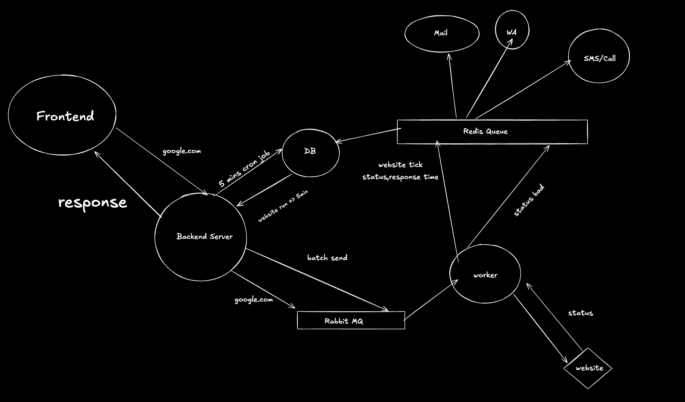

# BetterUptime - Website Monitoring Platform

BetterUptime is a robust website monitoring platform that helps you track the uptime and performance of your websites in real-time. Built with modern technologies and a distributed architecture, it provides reliable monitoring with instant notifications when your websites experience downtime.

## Features

- Real-time website monitoring
- Response time tracking
- Beautiful dashboard interface
- Distributed monitoring system using message queues
- Scalable architecture ready for growth

## Tech Stack

- **Frontend**: Next.js with TypeScript
- **API Server**: Bun with TypeScript
- **Worker**: TypeScript (with planned Go migration)
- **Message Queue**: RabbitMQ (Queue 1 to send jobs to worker)
- **Database**: PostgreSQL with Prisma
- **Package Management**: pnpm with Turborepo

## Getting Started

### Prerequisites

- Node.js 18 or higher
- pnpm
- Bun runtime
- RabbitMQ (or CloudAMQP account)
- PostgreSQL database

### Installation

1. Clone the repository:
```bash
git clone https://github.com/yourusername/betteruptime.git
cd betteruptime
```

2. Install dependencies:
```bash
bun install
```

3. Set up environment variables:
```bash
# In apps/web/.env
NEXT_PUBLIC_BACKEND_URL=http://localhost:3001

# In apps/api/.env
DATABASE_URL=your_database_url
RABBITMQ_URL=your_cloudamqp_url
PORT=3001

# In apps/worker/.env
RABBITMQ_URL=your_cloudamqp_url
```

4. Start the development servers:
```bash
bun dev
```

This will start:
- Web interface on http://localhost:3000
- API server on http://localhost:3001
- Worker service for processing monitoring tasks

## Architecture

The system is built with a distributed architecture to ensure reliability and scalability.



The architecture consists of several key components working together:

1. **Backend (BE)**: 
   - Runs a 5-minute cron job to check website status
   - Manages website monitoring tasks
   - Sends batch monitoring jobs to RabbitMQ

2. **Database (DB)**:
   - Stores website information
   - Records monitoring history and website ticks
   - Maintains response times and status data

3. **Worker**:
   - Consumes monitoring tasks from RabbitMQ
   - Performs actual website status checks
   - Reports status and response times back to DB
   - Triggers notifications on status changes

4. **Redis Queue**:
   - Handles notification distribution
   - Manages different notification channels:
     - Email notifications
     - WhatsApp (WA) alerts
     - SMS/Call alerts

5. **Monitored Websites**:
   - External websites being monitored
   - Status checks performed every 5 minutes
   - Response times recorded for performance tracking

Key components:
1. **Web Interface**: React-based dashboard for managing monitored websites and viewing their status
2. **API Server**: Handles website management and publishes monitoring tasks
3. **RabbitMQ**: Message queue for distributing monitoring tasks
4. **Worker Service**: Consumes monitoring tasks and performs actual website checks
5. **PostgreSQL**: Stores website data, monitoring history, and user information

## Development

### Project Structure
```
apps/
  ├── web/          # Next.js frontend
  ├── api/          # Bun/TypeScript API server
  └── worker/       # TypeScript monitoring worker
packages/
  ├── db/           # Prisma schema and client
  ├── ui/           # Shared UI components
  └── config/       # Shared configuration
```

### Running Tests
Inside apps/tests
```bash
bun test
```

### Building for Production

```bash
bun run build
```

## Contributing

1. Fork the repository
2. Create your feature branch (`git checkout -b feature/amazing-feature`)
3. Commit your changes (`git commit -m 'Add some amazing feature'`)
4. Push to the branch (`git push origin feature/amazing-feature`)
5. Open a Pull Request

## License

This project is licensed under the MIT License - see the [LICENSE](LICENSE) file for details.

## Future Improvements

### Authentication & Authorization
- Integration with BetterAuth for secure OAuth authentication


### Enhanced Notification System
- Redis-based notification queue for improved scalability
- Multiple notification channels:
  - Email notifications with customizable templates
  - WhatsApp integration for instant alerts
  - SMS/Voice call alerts for critical outages
  - Webhook support for custom integrations
- Notification rate limiting and batching
- Custom notification rules and schedules

### Monitoring Enhancements
- Time Series DB 
- Monitoring History
